# Access Map App Capstone 

---
# Introduction

This capstone project was created in my 15th and 16th  week of coding bootcamp at General Assembly using React, CSS, Javascript, Java, Spring Boot, and PostgreSQL. The project is a volunteer-driven maps application with a strong focus on accessibility. By leveraging crowdsourced data, the application provides valuable information about the most accessible places in various locations, helping users with disabilities navigate their environments more easily. As the project is full-stack, the [frontend](https://github.com/ashleyd480/access-map-app-capstone/tree/main/frontend-accessibility-app) and [backend](https://github.com/ashleyd480/access-map-app-capstone/tree/main/backend-accessibility-app) codebases are contained in their seperate folders. 

This project also presented me with various learning opportunities, where I was able to explore new React and Spring Boot concepts in addition to deep dive into connecting frontend and backend. Therefore, my readMe not only shows my design and code thought process but also things I’ve learned along the way in these 2 weeks. 

---
# Table of Contents

I. [Overview](#overview)
   - [Purpose](#purpose)
   - [Features](#features)

II. [UX Design](#ux-design)
   - [Accessibility Considerations](#accessibility-considerations)
   - [Live Feedback](#live-feedback)
   - [Conditional Rendering](#conditional-rendering)
   - [Flexible Navigation](#flexible-navigation)

III. [Set Up](#set-up)
   - [Data Seeding](#data-seeding)
     - [Helper Constructor](#helper-constructor)
     - [Randomization](#randomization)
   - [Error Handling](#error-handling)
     - [Try Catch Blocks](#try-catch-blocks)
     - [@Valid Annotation](#@valid-annotation)
     - [Binding Result](#binding-result)
   - [AOP](#aop)
   - [AuthController](#authcontroller)

IV. [Data Handling](#data-handling)
   - [DTO](#dto)
     - [ResponseDTO](#responsedto)
     - [PlaceSearchResultsDTO](#placesearchresultsdto)
     - [ProfileDTO](#profiledto)
   - [Model Mapper](#model-mapper)
   - [JPQL](#jpql)
   - [Local Storage](#local-storage)

V. [State Management](#state-management)
   - [Context API](#context-api)
     - [Auth Context](#auth-context)
     - [Username Context](#username-context)
     - [User Data Context](#user-data-context)
     - [Contribute Context](#contribute-context)
     - [Theme Context](#theme-context)
   - [Lifting State Up](#lifting-state-up)

VI. [React Hooks](#react-hooks)
   - [useEffect](#useeffect)
   - [useNavigate](#usenavigate)
   - [useParams](#useparams)
   - [useLocation](#uselocation)

VII. [Thinking Ahead](#thinking-ahead)
   - [Sorting Efficiency](#sorting-efficiency)
   - [Hash Mapping](#hash-mapping)


---
# Overview
## Purpose
The primary motivation behind this project is to address the lack of detailed accessibility information in existing map applications. Many individuals with disabilities face challenges when trying to find accessible locations, as traditional maps often do not provide the necessary details. By focusing on accessibility and encouraging community contributions, this project aims to create a more inclusive mapping solution that benefits everyone. 
There is also a significant and growing demand for accessible places and a reliable platform to find such information. A search on the Google Maps Connect forum for posts on “accessibility” returns 9000 plus [results](https://www.localguidesconnect.com/t5/forums/searchpage/tab/message?advanced=false&allow_punctuation=false&q=accessibility).
This project also is of personal interest to me. I have been a volunteer Local Guide for Google Maps since 2016, with an eye for accessibility and inclusion- getting small businesses and local parks on the map, as well as designing close-captioned [trainings](https://www.localguidesconnect.com/t5/General-Discussion/8th-Year-Local-Guide-Video-Tutorials-Index-and-Moar-Videos/td-p/3720162) for visual learners on Maps features. 

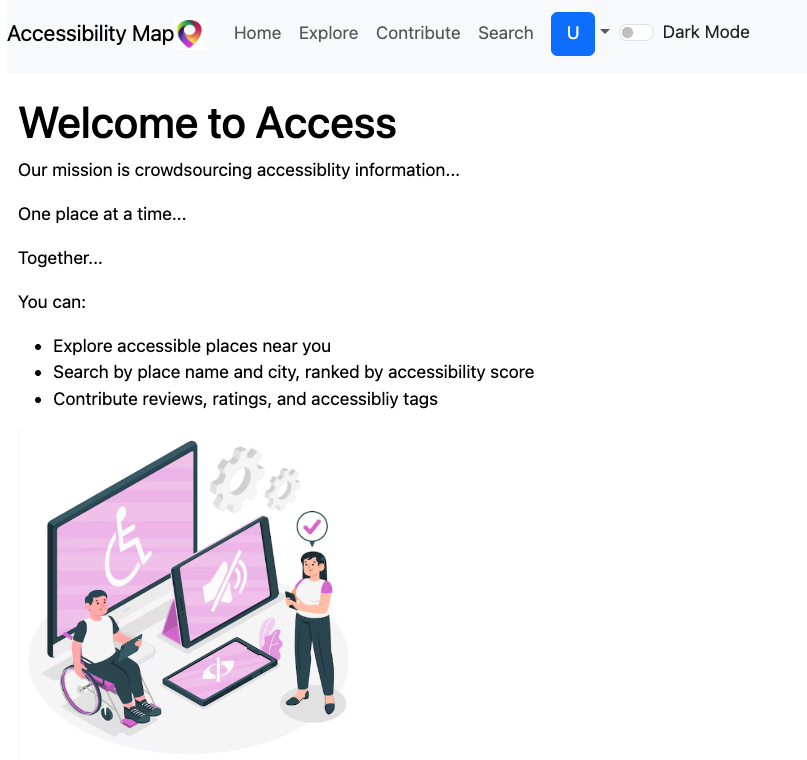

## Features
The app has the following main features: 
- Crowdsources Accessibility Information: Users can add details through tags and reviews about the accessibility of places they visit. This information is stored in a central database and made available to other users.
- Geolocation-Based Search: The app uses geolocation to show accessible places near the user's current location. This feature makes it easy for users to find accessible venues without having to manually search.
- Searching and Filtering: Users can search and filter results based on place name and/or accessibility rating. This helps users quickly find the most relevant and accessible places.
Some additional features include: 
- Place Details: Users can click into each place to see place details, reviews on accessibility, and accessibility feature tags. 
- User Profile: The profile page tracks the user’s contribution stats and history of contributions. 
To see the features mentioned above, you can view a quick ~9 minute demo [here](https://youtu.be/-HMOEHSRJvQ)

## Entities
The ERD diagram below shows the 5 entities of my app. 

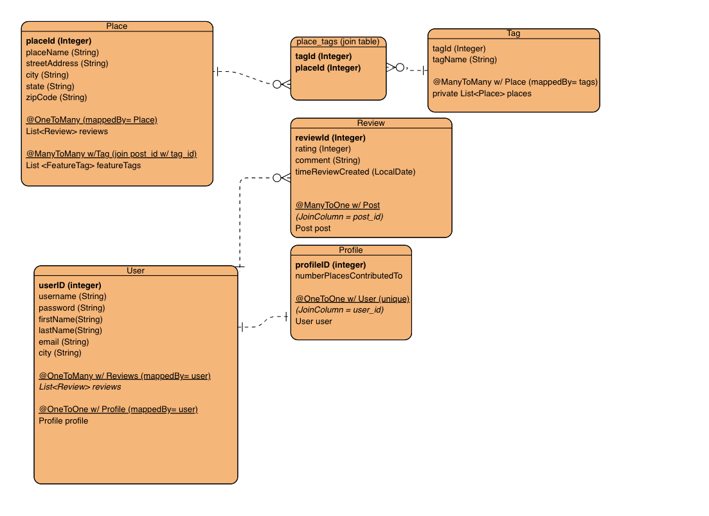
- User: users of the application
- Profile: each user has one profile with their contributions stats 
- Place: places in our database (to simulate having a map of searchable places)
- Feature Tag: pre-existing tags defined in our database for users to tag places:  low-sensory, hearing-loop, braille-tactile, wheelchair-accessible, and service-animal
- Review: user reviews and ratings of the accessibility of places.
Note: I was able to resolve the [issue](https://github.com/ashleyd480/referral-site-api-backend?tab=readme-ov-file#foreign-key-constraint)  I had in a previous backend project of mine where users were unable to be deleted due to the `userId` being a foreign key constraint in other entities. This was fixed in this capstone by using `CascadeType.ALL` above reviews and profile:

```
   @JsonIgnore
    @OneToMany(mappedBy = "user", cascade = CascadeType.ALL)
    private List<Review> reviews = new ArrayList<>();

    @OneToOne(mappedBy = "user", cascade = CascadeType.ALL)
    private Profile profile;
```
This way, the backend performs a cascading delete, so that when a user is removed, all the user’s reviews and the user profile will be deleted, eliminating the issue of foreign key constraint. 

## Installation
When cloning the project for use- make sure to run `npm i` to install required React dependencies on your local machine. Also, you will want to run the following three lines, as my app uses react-router, react-icons, and react bootstrap:

```
npm install react-icons -save
npm install react-router-dom
npm install react-bootstrap bootstrap
```

---
# UX Design
My React app codebase is separated into presentational components, and containers which handle the logic and API calls. Components are “called” in the containers. When brainstorming the CSS and app frontend flow, in addition to my initial [wireframe](src/wireframe.pdf), here was my design approach: 

## Accessibility Considerations
The user interface (UI) of the application is designed to be clean and low-sensory. In the log-in and sign-in page, I experimented with code to allow for compatibility with screen readers. This approach ensures that the app is accessible to users with sensory processing issues and those who rely on assistive technologies. Additionally, the app is inclusive of multiple devices, as it is mobile-responsive (with a hamburger style menu and buttons as a single-stacked column vs side by side when on mobile devices). 

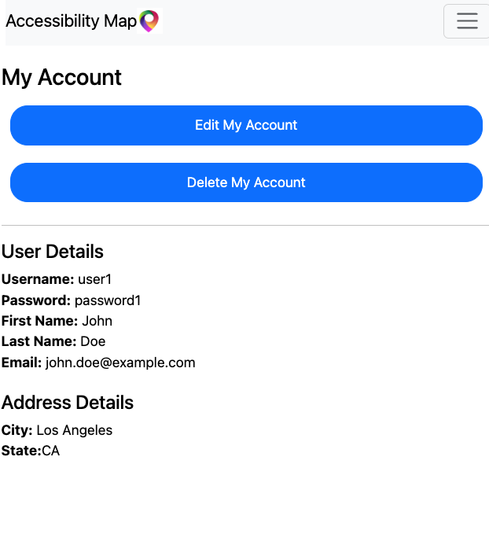

Using React Bootstrap supported my design choices, as components from its library have built-in mobile responsiveness, particularly the navigation bar. Also, Bootstrap’s forms have `controlId` attributes which allow screen readers to properly associate the label text with the input field. 
## Live Feedback
My design also aims to provide live feedback to the users. If there are errors returned from the API calls such as when validating sign in, or populating search results or geolocated places- an error message appears conditionally with the nullish coalescing operator `&&`. 
In the log-in and sign-up page, a “polite aria” is used so that the error message can be read by screen readers, and “polite” ensures that it is not read in a manner that interrupts the user.
```
  <div aria-live="polite" className="errorContainer">
  {error && <h4>{error}</h4>}
```
If something executes successfully, either a success page or a success message appears. For example, when a feature tag is successfully added, a message appears to let the user know. Also, when a user has correctly finished signing up, they see a page letting them know that and are redirected to click on a button to go back and sign in. This way, users are never left in a black hole, regardless of the outcome of their actions.
Another way live feedback is provided is by immediately letting the user see the result of their actions. For example, once a user successfully submits a review, they are redirected back to the page for that particular place they were reviewing and they will be able to see their added review. The same goes for when a user is done adding a tag, they can click to Go Back, and they will land on the “Place Detail” page, so they can see the tags were added.

## Conditional Rendering
Not only are the errors conditionally rendered as mentioned above, I also conditionally render other page elements such as search results. This is to ensure streamlined presentation of webpage information. In this case, we check to see if there are actually any search results to display, and if so- we display them, otherwise- we will populate the `div` with the error message.
```
<div>
{searchDynamicSearchResults.length>0 ? (
  <PlaceResultsList placeSearchResultsProp={searchDynamicSearchResults} />) : (
                    <p className="errorContainer">{error}</p>
)}
```
Another example is in the place search results (which are the matching places shown on `Explore`, `Contribute`, and `Search`); we only display tags if the place has them- thus conditionally displaying them (and if present- mapping the list of tags as bullet points):

```
  {place.tags && (
              <>
                <h6>
                  {" "}
                  <strong> Feature Tags </strong>{" "}
                </h6>
                <ul>
                  {place.tags.map((tag, tagIndex) => (
                    <li key={tagIndex}>{tag.tagName} </li>
                  ))}
                </ul>
```


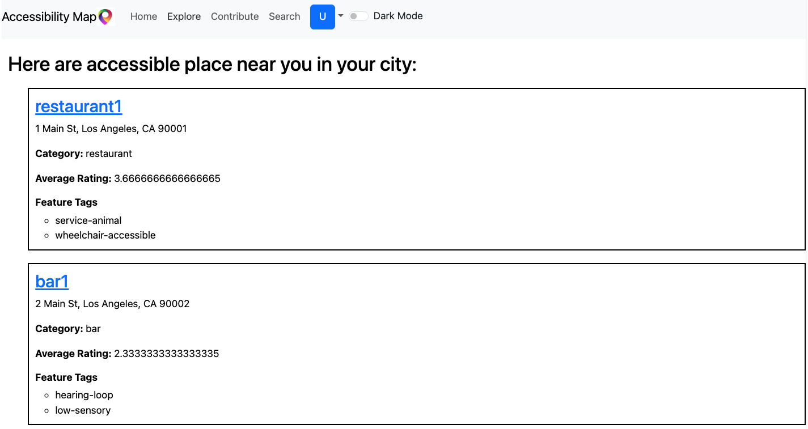

## Flexible Navigation

When brainstorming the flow with pages and buttons, I never wanted users to feel limited to a single choice. That is why a Go Back button variation is used when a user is taking action on their account. For example, when users are on the Edit Account page, users are presented with two buttons: one to allow them to go back if they changed their mind, and a second button to submit their account edits (which then routes them back to My Account to see their changes once completed).

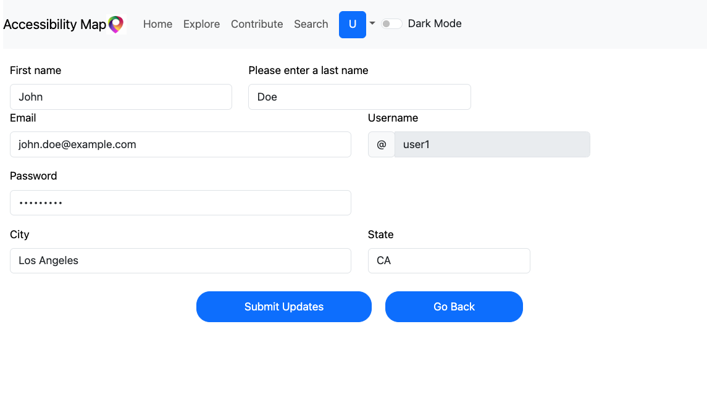

For deleting an account, as that is a highly consequential action, I also design a confirmation page where users are presented with a question to confirm if they are sure along with two buttons: one to go back and another to move forward with deletion. This prevents click-happy users from accidentally deleting their own account. 

---
# Set Up

## Data Seeding
To ensure the app has places loaded along with user reviews (to simulate a database of Maps places) along with our five pre-populated feature tags, a data seeding mechanism is used. This seeded data ensures that the app is functional and informative even in its early stages.
Data was seeded by implementing the CommandLineRunner interface and we use `@Override` in the `MainDataSeeder` class to define the startup tasks. (Note: The CommandLineRunner interface is part of the Spring Boot framework and provides a way to execute custom code when the application starts up.) 
We seed the users first, then the tags, then places (which take the seeded tags list to randomly add some tags to the places), and lastly we seed the reviews (which take the seededPlaces and seededUsers- to effectively allow us to associate the reviews to the place and user). 

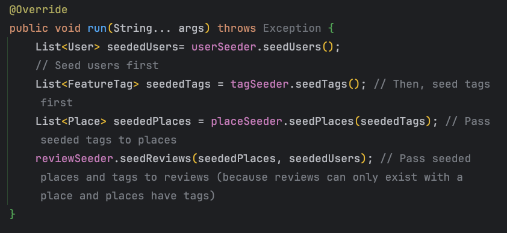

The `MainDataSeeder` is autowired to the other 4 aforementioned data seeders, allowing us to call the methods defined in the injected instances of the other data seeder classes (which you can see in the screenshot above).

### Helper Constructor 
Each of the 4 data seeders for the respective entities of users, tags, places, and reviews follow a basic pattern. We initialize an empty `ArrayList` with the type defined as that entity, i.e. `List<User> usersToAdd`. We then call `.add` on it and call a “create” method that essentially uses the concepts of constructors in Java. This “create” method is defined as a helper method in each class- essentially creating a new instance of that entity and using setters to assign the values in the constructor parameters as the values of those specific attributes (i.e. username, etc) of that entity instance. 

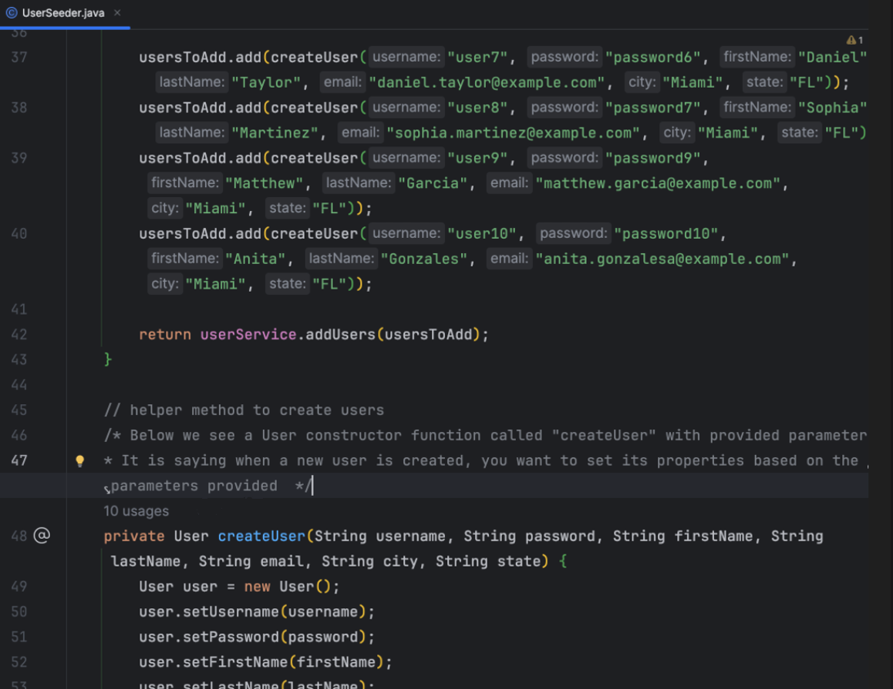

### Randomization
`Math.random` randomizes reviews and tags to places, and users to reviews. `Math.random` is a decimal between 0 and 1, and `(int)` casts an integer data type, making the result a whole number integer- which we can then use to represent the index position of an array of reviews, tags, etc. 
For example, to randomize a comment to display at each place, we can directly refer to the comment by its randomized index, as we are referring to an array of comments I provided.

```
    private static String getRandomComment() {
        int randomIndex = (int) (Math.random() * randomSeedComments.length);
        return randomSeedComments[randomIndex];
    }
```

To randomize a user from our list of seeded users, we use the `.get` and we must do that because now we are working with an ArrayList. The List interface doesn't allow direct access to the underlying data structure, which is why we can’t directly call the index and must use the `.get.`

```
 private User getRandomUser(List<User> users) {
        int randomIndex = (int) (Math.random() * users.size());
        return users.get(randomIndex);
    }
```

## Error Handling

### Try Catch Blocks 
On the backend service classes, try/catch blocks are implemented to handle database issues, ensuring that the app can gracefully manage errors without crashing or causing data loss.  `e.getMessage()` displays the exact exception message associated with the caught exception, which proved essential to debugging any issues as I could see the errors in the console. 

(Note that also within the try block, the `orElseThrow(() -> new RuntimeException` is used to catch exceptions for optionals, for example when a user by an id might not exist.)

In the frontend, try/catch blocks are used when making API calls to the backend, and it catches any issues with the API call being unable to be completed. 

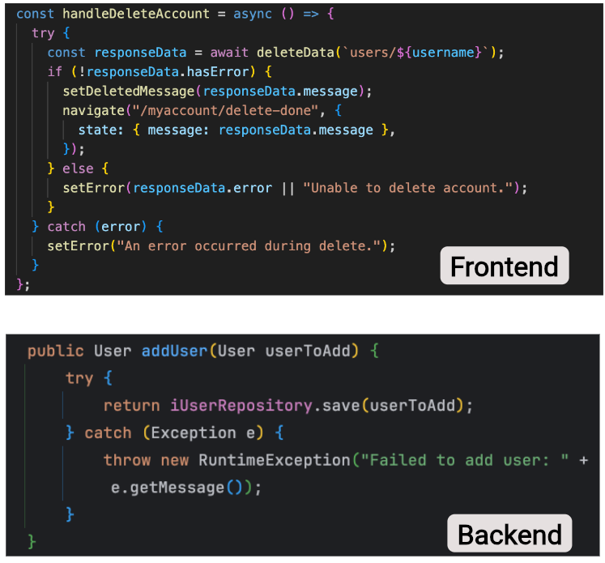

### @Valid Annotation
My app is able to conduct validation with the “spring-boot-starter-validation” dependency.
`@Valid` is used over attributes in the entities as well as in the DTOs (Data Transfer Objects) to ensure correct user input. This could check for non-blank input, input size, as well as valid formatting. Here is an example of some of the annotations used in my `User` class. 

```
@NotBlank(message = "Password is mandatory")
@Size(min = 8, message = "Password must be at least 8 characters long")
private String password;

@NotBlank(message = "Email is mandatory")
@Email(message = "Email should be valid")
private String email;
```

You can see how to the right of each annotation, a custom message is included in parenthesis. This custom message is conditionally rendered on the frontend to inform users of any issues (detailed [here](#live-feedback)). 

### Binding Result 
To ensure live feedback to the front-end users of any input errors, we use `BindingResult` along with my `ResponseDTO`.
 
`BindingResult` is an interface provided by the Spring Framework that holds the results of a binding and validation process for a form or web request. My method for processing the “binding result” is stored in my `Utils` package to keep things DRY, since for any methods that deal with user input, we would need to do the “binding result” processing.

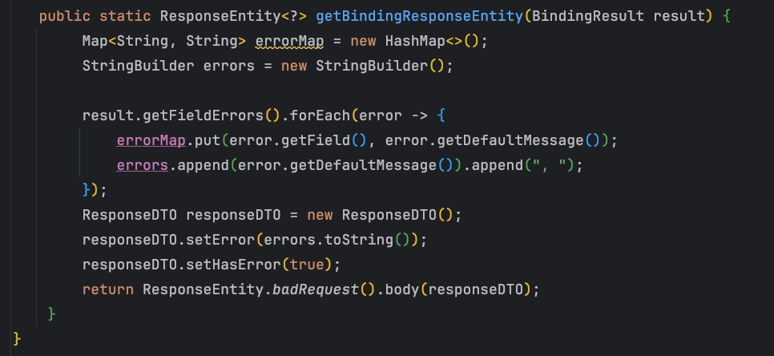

To briefly explain the code logic (and kudos to my instructor for help on this): 
1. We initialize a hashmap called `errorMap` to store the fields and their corresponding error messages. 
2. StringBuilder is used to build a comma separated string of all error messages. It iterates over all the `FieldErrors` in the binding result, and for each one: a key-value pair is created with the field (i.e. username) and error message(s) - i.e.  “Username is mandatory.”
3. These key-value pairs are added into that `errorMap`, with `errorMap.put`
4. It also appends the default error message to the errors StringBuilder, followed by a comma and a space, with `errors.append`
5. Once done iterating over all those errors, a new instance of `ResponseDTO` is created. 
6. The setter is used to set the `error` attribute of the `ResponseDTO` instance to the string version of the `errors` which we created with StringBuilder.
7. It sets the hasError property of the ResponseDTO to true, indicating that there were validation errors.
8. Finally, it returns a ResponseEntity with an HTTP status code of 400 Bad Request and the `ResponseDTO` instance as the response body.


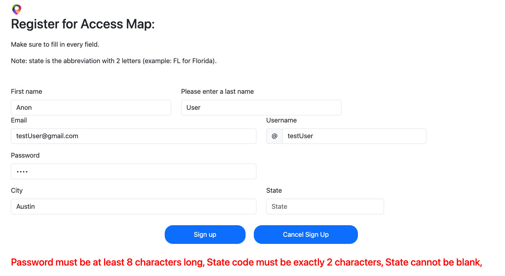

## AOP
We use `LoggingAspect` (`@Aspect` indicating that this class “spies” on other classes”). Our `@Pointcut` tells us this class will be looking at all controller and service methods. 
The `@Around` annotation indicates that the method will run both before and after the execution of the target method.
1. `log.info` is used to log a message before the the method is executed (and this happens because we call it before we calling `proceed()`)
2. In the try block, `Object result = proceedingJoinPoint.proceed()` calls the actual method that was intercepted.  The `proceed()` method executes the target method and returns its result. 
3. If it executes successfully, `log.info` will log a message along with the trigger time.
4. Otherwise, if there is an issue that will be caught by the `catch` block which will log the exception. 
We are able to know the exact method these messages pertain to due to the `proceedingJoinPoint.getSignature()`.

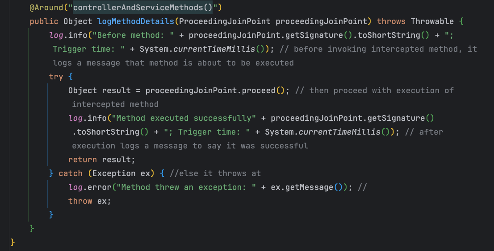

## AuthController
The `AuthController` class in Spring Boot is used to help authenticate the sign-up and login process. 
- With sign-up, it validates the user input and displays errors on the frontend with “binding result.” It also checks the username provided in the request body (sent from frontend user input) to see if the username already exists in the database, ensuring that each user has a unique username. 
- With login, it similarly validates the user input and displays errors on the frontend, as well as checks to see if the username doesn’t exist (and if so prompts the user to sign up instead). It furthermore checks to see if the password is valid. 

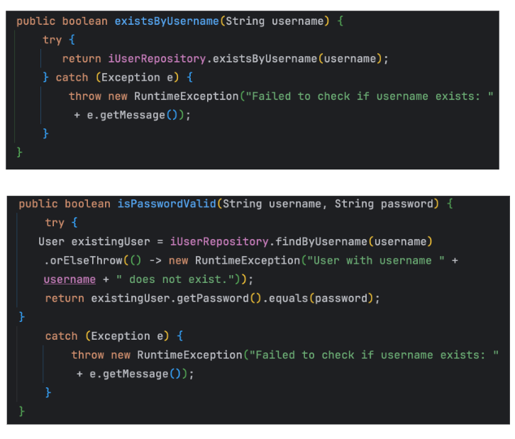

## Error Page 
If a user mistypes a URL, an error page is defined at the very end of Routes in `App.JSX.`:
` <Route path="*" element={<Error />} />`.
This means that is a user types in a URL that does not match any of the provided routes (as denoted by the `*` wildcard), then the `Error` component will render.

This error page displays an error message to users and displays  a button that users can click to return to `Home`.

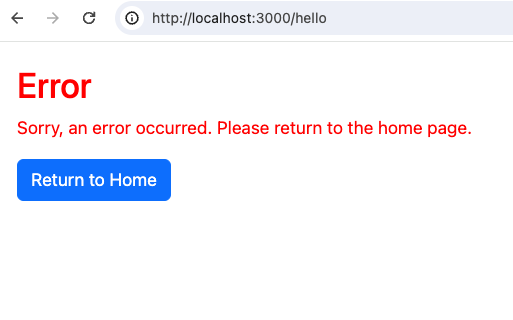

---

# Data Handling

## DTO
DTOs are used to display data on the frontend as well as to retrieve data back. Below I wanted to highlight some of the more crucial ones. 

### ResponseDTO
As you saw [above](#binding-result), the `ResponseDTO` helps with rendering the binding result errors from user input errors (which Spring validates on the backend). I can also use the `error` attribute for any other custom errors that may not be handled by Spring’s validation. 

```
@Data
@AllArgsConstructor
@NoArgsConstructor
public class ResponseDTO {
    private String message;
    private String error;
    private Boolean hasError;
}
```

In the example below, the Explore tab features locations in a user’s city, however if there are no matching places for the user’s location, then an error message should render, and additionally- we set the ‘hasError’ attribute to `true`. 

This way, in the frontend, we can use that boolean value of `hasError`- meaning that if there were no errors from our “binding result” input validator (when handling user inputs) or our custom error logic (i.e. no matching places by user location), then we can go ahead and display that response data from the API call, or handle the request body sent from user input. Otherwise, if there was a `hasError` set by our “binding result” or our custom error logic on the Controller method, then it will set the state of the component’s `error` to the `responseData.error` Finally, as aforementioned, for any other errors that we are not able to catch such as API connection errors, the catch block handles it and displays an error message for those cases as well. This way, the user is never left in the dark, even when a page element malfunctions. 

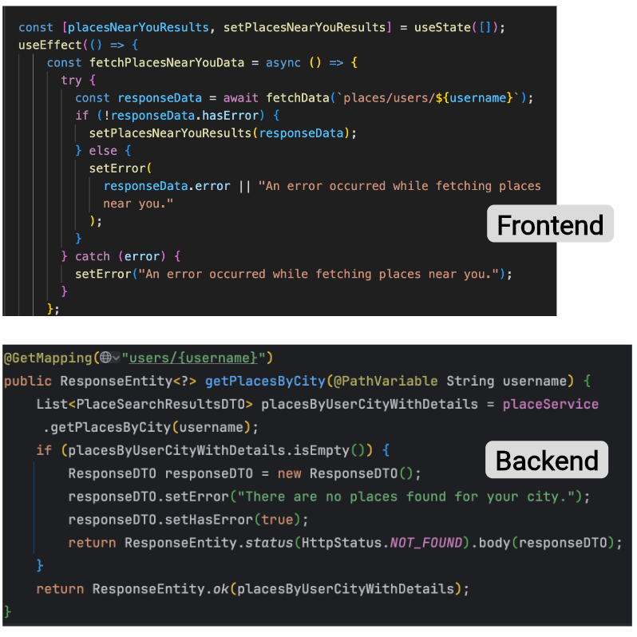

`ResponseDTO` can also be used to display success messages as well, as this DTO has a ‘message' attribute. For example, we use `responseData.message` attribute on the frontend to render the message to let a user know that their account been successfully deleted.

### PlaceSearchResultsDTO
This was used to display the search results (which includes the place details along with the tags for each place, and the average accessibility review rating for each place. Without this DTO, it would mean having to somehow finagle multiple API calls to the place, review, and tag entity endpoints. With this, we can just make a single `GET` mapping on the `PlaceController` to return this DTO. 

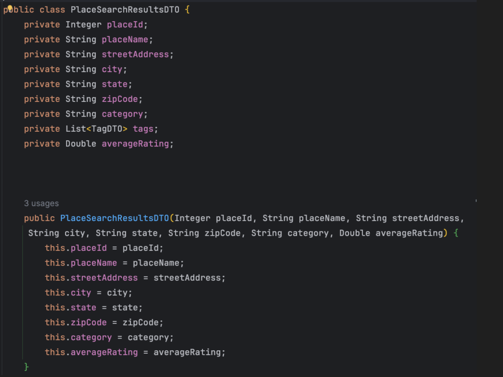

The DTO is formatted as shown in the screenshot above. You can see how it includes List<TagDTO> tags. Additionally it includes a custom constructor. The reason for that is in the JPQL method in `IPlaceRepository` to fetch these `PlaceSearchResults` DTOs, the first line states that for each result queried, we create a new `PlaceSearchResults` DTO (which represents one search result) that has the attributes of the place and average of the reviews ratings for that place.  
```
 @Query("SELECT new com.example.backendspringcode.dto.PlaceSearchResultsDTO( " +
            "p.placeId, p.placeName, p.streetAddress, p.city, p.state, p.zipCode, p.category, AVG(r.rating)) " +
            "FROM Place p LEFT JOIN p.reviews r " + …
```
The service method then iterates over each place in the `List<PlaceSearchResultsDTO>` and calls our custom method of `findTagsByPlaceId` as defined in our `ITagRepository.`

### ProfileDTO 
`ProfileDTO` is used to display on the user's profile page both the number of places a user has contributed to along with the list of reviews they have made (also transferred as a DTO). The number of contributions would simply be the length of the List<ReviewByUserDTO>. 

```
public class ProfileDTO {
    private Integer numberPlacesReviewsContributedTo;
    private List<ReviewByUserDTO> userReviews;
}
```

## Model Mapper
The Model Mapper library is used on the backend to allow efficient handling of users editing their account details.  When using it, we create a new instance of model mapper, and then we can map the edited account attributes received from `UserUpdateDTO` (which is the format of the request body that is sent back to us from the user input on the frontend).

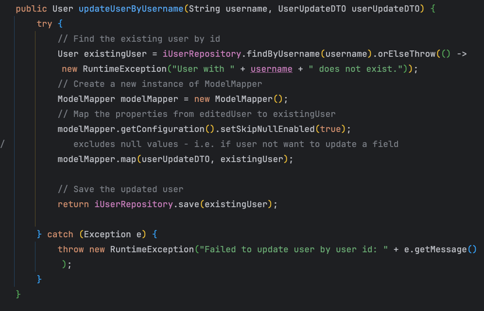

Note: `setSkipNullEnabled(true)` is a best practice in Model Mapper, so this way even if a user only choose to update say their first name, when mapping- we would skip over any null values that user doesn’t input - preventing the case of updating user attributes to null, but rather changing the field the user wants to change while keeping the other fields constant. 

## JPQL 
The search functionality (which is used to allow users to both search for places to learn about them, as well as to search for places to contribute to) relies on JPQL in the `IPlaceRepository.` On the frontend, users can search by place name (keyword) and/or city and sort by ascending/descedning order. 

As such, there are 3 distinct JPQL to allow for querying based on whether the user chooses to search by one or the other or both.
In the example below, we see the JPQL for handling search by keyword:

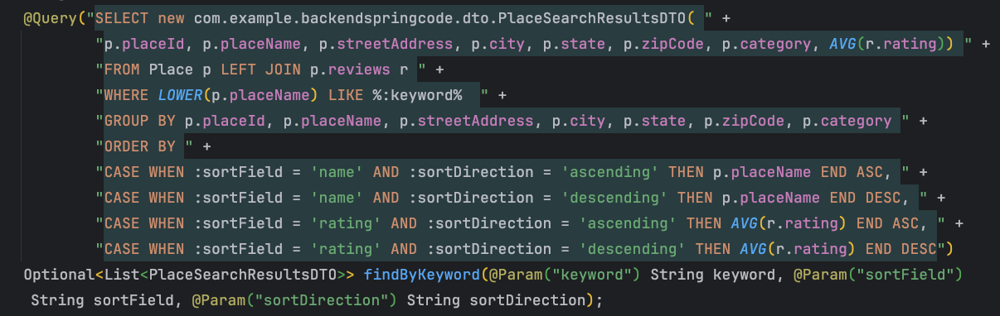

1. With each query, as aforementioned, a new `PlaceSearchResults` DTO is generated which includes that place’s id, etc along with the average review rating. 
2. The `LEFT JOIN` with reviews- means that we will get all matching places, regardless of whether they have reviews. 
3. Since we are calculating average review rating we have to `GROUP BY` the non-aggregated place attributes. Grouping essentially collapses the data by place- which is how then we are able to get the average rating for each place.
4. The `WHERE` statement filters out the results only where the place name contains the keyword. `LIKE` allows us to use the pattern search with the wildcard character `%` in front and behind of the search term to allow us to see any place matches that contain that term.  
5. At the end, we use `CASE` to handle different sorting criteria: sort by rating or city, and by ascending or descending. `CASE` is similar to switch statements in Java. You can see `ASC` or `DESC` after the `END` clause- to indicate that only if the conditions in that particular `CASE` are met do we sort by that sorting order. 

Note: The `sortField`, `sortDirection` and search terms are received from the front end as request params. The values are received from user input in the search form on the frontend as you can see in the screenshot below. 

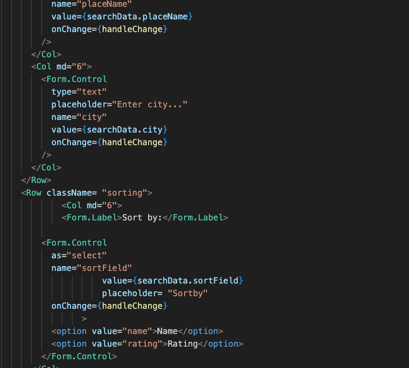
From the search form, the user input is then provided as request params to the backend via the following API `GET` mapping call in the `Search` component. 

```
const responseData = await fetchData(`places/search?keyword=${searchData.placeName}&city=${searchData.city}&sortField=${searchData.sortField}&sortDirection=${searchData.sortDirection}`);
```

## Local Storage
The app stores the username in local storage to display a dynamic logo with the first initial of the username on the nav bar- allowing for a more personalized experience. The user can click on it  
unfurl a dropdown menu to see their profile, manage their account, and sign out. 

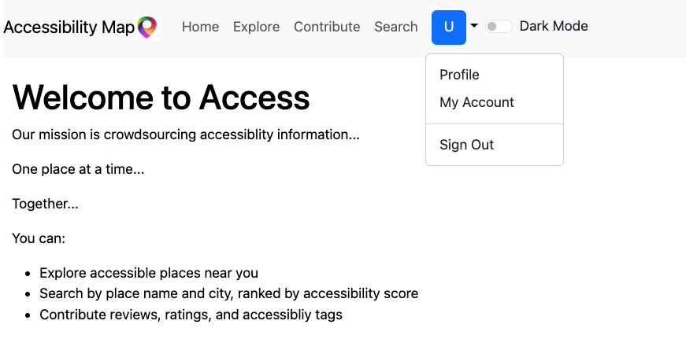

This local storage is set upon a successful `POST` mapping call for user sign-in:
` localStorage.setItem("username", username);`

Upon sign out, we clear the local storage upon sign-out. This is done through an onClick handler for when Sign Out is clicked on the nav bar:
`  localStorage.setItem("username", "")`

Note: I chose not to use local storage to store username or other information through other parts of the app due to slow loading times which would cause issues when we needed that information in order to make API calls to display information. Context API was instead used in those cases (detailed below).

--- 
# State Management

## Context API
Context API is used to manage global state across the application. This approach eliminates the need for prop drilling, where props are passed down multiple levels of the component tree. 

The Context APIs are defined in the `contexts` folder in the codebase, and then the state variables and setters are declared globally in `App.JSX`, and the routes are wrapped with the context providers. This allows state to be shared directly among components, improving code readability and maintainability.

To use these contexts, we use the `useContext` hook. We make sure to import  `useContext` as well as the context API we want to use in the component we want it on. Then we make sure to declare the useContext such as: 
`const { userSignedIn, setUserSignedIn } = useContext(AuthContext);`

### Auth Context 
This context manages the user authentication state and routes within the application.

```
export const AuthContext = createContext({
     userSignedIn: false , setUserSignedIn: () => { }
})
```
When a user signs in, this AuthContext is set to true. This is what allows users to see the navbar, footer, and the other pages of the app only when signed in. This is done with the conditional rendering of those components and routes only when `userSignedIn` is true, via this code block on `App.jsx`.

```
{userSignedIn && (<> <Header/>  <Footer/> </>)}
            <Routes>
```
Additionally, the default landing page of `/` on localhost will redirect users to the login landing page if the value of UserSignedIn is `false` as you can see below:

```
  useEffect(() => {
    if (!userSignedIn) {
      navigate("/signin");
    }
  }, [userSignedIn]);
```
Otherwise, after they sign in, on `SignIn.jsx`, the following code will redirect users to the home page. 

```
  useEffect(() => {
    if (userSignedIn) {
      navigate("/");
    }
  }, [userSignedIn]);
```
That is why when you connect to localhost, it will see you are not signed in and serve you the login page. However, it will re-render and display the Home Page at `/` when the value of `userSignedIn` changes to “true.”

### Username Context
This is used to fetch data based on the user’s username. For example, on the Explore tab, we geolocate places based on a user’s city which we fetch by the username’s city on the backend. 
```
if (username) {
    fetchPlacesNearYouData();
}
```
The useEffect hook with an empty dependency array ([]) means that the API call to fetch place details (fetchDetailsForThisPlace) will occur once the component is loaded.
However, the API call will only be made if the username is populated from our `UsernameContext`. So, effectively, the API call will be made once the component is loaded and there is a username available. 

### User Data Context
This is used to pre-populate the Edit Account form with the user’s existing account details,  allowing users to make edits of what they need. We populate `UserDataContext` with the `GET` mapping call on My Account. This not only allows the account details to show on that page, but also sets the values of `UserDataContext.`

Then, in the Edit Account page, we use a copy of `UserDataContext` to initialize the values in the form:
```
 const [formData, setFormData] = useState({ ...userData });
````
This allows us to still display the userData, while also allowing us to type modifications to the userData without actually modifying the original userData values. Then, only when we click Submit, does this then send the `PUT` mapping request to update the userData. With a successful `PUT` API call, the page then redirects back to the My Account page with the `useNavigate` hook- where the `GET` mapping call is made- showing the updated account information, while also updating the `User Data Context`.
### Contribute Context 
`ContributeContext` determines when to display "add review" and "add tag" buttons, which we only want to appear on a place details page when navigating from the Contribute page. On the `Contribute` component, we have: `setShowReviewandTagButton(true);`. And then, on the `Search` and `Explore` components, we set it to false. 
Then, in the `PlaceDetailComponent`, we use conditional rendering to show those buttons only if the `showReviewandTagButton` is true. 
```
   {showReviewandTagButton && (
        <>
          {" "}
          <div className="buttonGroup">
          <Button onClick={handleAddReview}> Add Review</Button>
            <Button onClick={handleAddTag}>Add Tag</Button>{" "}
            </div>
        </>
```
### Theme Context
We use this to help toggle dark mode and have that user choice persist across all pages. In `NavBar.jsx`, there is an onToggle handler that uses a ternary to determine what to set the page theme to.

```
  const handleSetTheme = () => {
    setTheme(theme === "light" ? "dark" : "light");
  };
```
Essentially, it is checking to see if the current theme state value is “light”, and if so, when the user toggles, it will change it to “dark” and vice versa.  Then, in our other containers, we use template literals so that the theme can be dynamically rendered based on what it’s current state is based on the user toggle: `<div className={`${theme} content`}>`
## Lifting State Up
With the search bar, the search input state needs to be shared among multiple components (`Search` and `Contribute`), so the state is lifted up to both. Both `Search` and `Contribute` have the following lines of code:

```
…
const [searchData, setSearchData] = useState({
        placeName: '',
        city: '',
        sortField: 'rating',
        sortDirection: 'descending',
    });
…
 return (
…
  <SearchBar searchFunctionProp={handleSearch} searchData={searchData} setSearchData={setSearchData} />
```
By lifting the state up to a common ancestor component (in this case, both Search and Contribute components), the search input state of `searchData` is shared among multiple components. 
Then, we pass the state and its corresponding onChange input handler of `handleSearch` as props down to the child component: `SearchBar.jsx.` This allows the child component to access and interact with the search input state without directly managing it.
`SearchBar.jsx` then takes those props and uses them as shown in the screenshot below. 

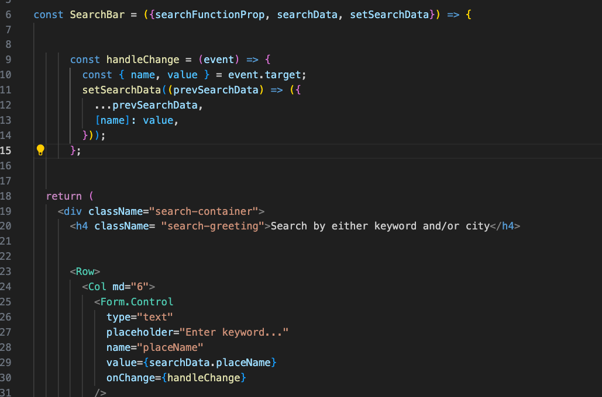

You can see how not only is the presentation of the `SearchBar` defined, but also when `SearchBar` is called in the parent components of `Search` and `Contribute`, that is how it knows the actual values of the search data and handler via that aforementioned prop passing. 

---

# React Hooks 
Our app uses several react hooks to enable efficient routing and state management, ensuring that the app is responsive and easy to use. 

## useEffect
This is used to handle API calls such as rendering My Account details on component mount as we saw in [Username Context](#username-context). In that example, the API call to load the account details would only happen when the component loaded and when the username was retrieved from the Context API.  `useEffect` was also used to redirect the users from localhost’s default landing page of `/` by checking on the state of `userSignedIn`.

We also used `useEffect` when making the get mapping call to display all the available tags for the user to choose from on a place detail’s page. The call to fetch these available tags would happen only on component load and only when the `placeId` is retrieved from the `useParams` hook of the URL. These available tags are then mapped over a list of `Tag` components and displayed as buttons. Each button has an `onClick` function of `handleAddtag(tagId)`, with the parameter of `tagId` received from the `GET` mapping call in `AddTag.jsx`. This way, when a button is clicked, we would know which `tagId` is assigned to that button so the correct `tagId` is associated with that place on the backend. 

Note: with onClick functions to make API calls, useEffect was not needed- as the with those functions- the click is what would trigger the calls vs a component mount or a state variable’s state changing.

## useNavigate 
`useNavigate` hook is used to programmatically navigate users to different routes within the application. This is particularly useful for redirecting users after certain actions, such as after logging in or signing up.

For example, in [Auth Context](#auth-context), we saw how in`SignIn.jsx`, the user is navigated to the home page if they are signed in. 

## useParams
`useParams` is used to generate the item detail list for the places in the `Explore`, `Contribute`, and `Search` tab. This means that each place is clickable so the user can click in to view more details and/or can contribute a review/tag when navigating from `Contribute.`

Each of those three aforementioned tabs take the list of results and map them over an unordered list with each result being a bullet point. We hyperlink the `place.placeName` which is retrieved from the `GET` mapping- and each place name is hyperlinked to the url ending with its `placeId` (which is also data we received from that mapping.

```
 <Link to={`/places/${place.placeId}`}>
              <h3>{place.placeName}</h3>
            </Link>
```

Then, in the `PlaceDetails` container, we import the `useParams` hook and get the `id` parameter from the URL. As it was displaying as an object, we used dot notation to access its value.  Then, we converted it to an integer. 

```
const id = useParams();
const placeIdString = id.placeId; 
const placeId = parseInt(placeIdString);
```
From there, we can use `placeId` to fetch the details for that place via a `GET` mapping call. 

When viewing a place detail page from the Contribute Page, `useNavigate` uses the placeId to navigate to the relevant page such as `/places/${placeDetailsProp.placeId}/addreview.` 

In the `AddReview` and `AddTag` components, we then import the `useParams` hook again to get the `id` from the URL and retrieve its value again with dot notation `const placeId = id.id;`
We use this `placeId` when making the `POST` mapping call when adding a review or tag. We also use to redirect users back to the place details, i.e. after a user is done adding a review, they are navigated with the navigate hook: `navigate(`/places/${placeId}`


## useLocation
`useLocation` allows you to access the state that was passed during navigation. When you navigate to a new route using navigate, you can pass along the state directly in the navigate function. The new route can then access this state using `useLocation`.

The `useLocation` hook is used to display `placeDetail` information from the place detail page to the pages for adding review and adding tags. 
This is how the information from `placeDetail` is passed along so that the instruction message is specific to that location. For example, in the screenshot below, the instructions say “Please write a review for restaurant1 located at in Los Angeles and CA :”.  This helps provide that “confirmation” to users of the place they are reviewing. 

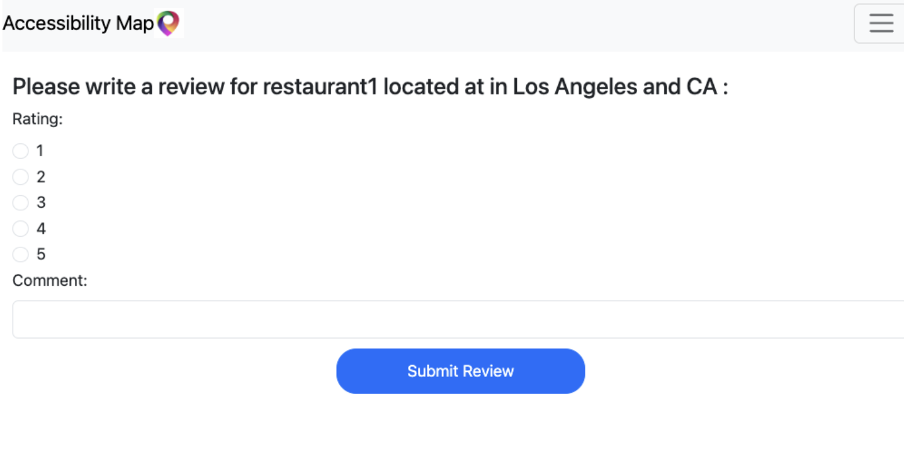

The way the useLocation works with `placeDetails` is: 
1. `PlaceDetails` container makes the `GET` call to get the place details by the place id from useParams.
2. `PlaceDetails` calls the `PlaceDetailComponent` and passes the `placeDetails` retrieved from that API call as a prop. `<PlaceDetailComponent placeDetailsProp = {detailsForThisPlace} />`
3. Then `PlaceDetailComponent` takes that placeDetails prop and passes it along as a state in conjunction with the navigate function. `state: { placeDetails: placeDetailsProp }`
(Note: `placeDetails` is the key of the state object we are passing to the target route. `placeDetailsProp` is the value being assigned to the placeDetails key.)
4. Finally, in the `AddReview` and `AddTag` components, we import the `useLocation` hook. 
5. We declare `const { placeDetails } = location.state;` to destructure it so we may access the `placeDetails` property and then use dot notation to dynamically instructions, i.e. “ Please write a review for {placeDetails.placeName}”

```
// PlaceDetailComponent.jsx
const handleAddReview = () => {
    navigate(`/places/${placeDetailsProp.placeId}/addreview`, {
      state: { placeDetails: placeDetailsProp },
    }

//AddReview.jsx
const AddReview = () => {
const location = useLocation();
 const { placeDetails } = location.state;
```
For deleting an account, the useLocation hook is employed to carry the deletion success message. Once a user confirms they want to delete their account, the success message is set  and then passed as a `state` within the `navigate` function:

```
//MyAccountDelete.jsx
   try {
      const responseData = await deleteData(`users/${username}`);
      if (!responseData.hasError) {
        setDeletedMessage(responseData.message);
        navigate("/myaccount/delete-done", {
          state: { message: responseData.message },
        });

//MyAccountDeleteDone.jsx    
const { message } = location.state;
…
return (
    <div className={`${theme} content` }>
    <h1>{message}</h1>

```

----
# Thinking Ahead 
Due to time constraints and the time investment needed for learning new concepts necessary for executing this project,   I wanted to point out my own areas of opportunity and what other ideas could have been implemented. One thing I realized through my research in my second week was the benefits of DTOs for API calls, and I was able to make a fix to where ~95% of my transactions use DTOs. Using a Model Mapper bean could further facilitate converting DTOs back to entities and vice versa. I will also note that while I did not get to the testing due to time, I did extensively test throughout the project with manual testing via Postman and frontend interactions.

Some other additional UX features I would have added if there was more time in this capstone would be: allowing users to edit or delete their reviews, and clickable profiles so that each user could see others users stats and contributions. It would also have been neat to be able to integrate with Google Maps API, allowing for a more built-out database of places that users can then crowdsource accessibility information on.

Furthermore, I am aware that we have only barely touched the tip of the iceberg in the realm of learning about software development, and I can see areas to further increase my code efficiency and clarity. For example, I could use a global payload object in my React codebase. Another thing would be avoiding hardcoding values such as when I mapped the ratings form as follows ` {[1, 2, 3, 4, 5].map((value) => {`

Below are some other ideas I had as I think ahead: 

## Sorting Efficiency
As data size grows, I can also implement better querying by keeping the dynamic search logic by keyword and city in the backend, and sorting can be handled by the front end by the `.sort` method. This is because if say the user's keyword on the frontend doesn't change, and they simply are just changing how they are sorting, this can cause unnecessary calls to the backend. 

An example code block could look like this:

```
const sortPlaces = (places, sortField, sortDirection) => {
// When sorting using the subtraction approach, the negative value determines the order of elements in the sorted array.
    return places.sort((a, b) => {
        if (sortDirection === 'ascending') {
            return a[sortField] - b[sortField]; // return negative if a comes before a 
        } else {
            return b[sortField] - a[sortField]; // return negative if b comes before a 
        }
    });
};
```

## Hash Mapping
Currently, to get the list of available tags at a place, we use a nested loop. This loop looks through each tag on `allTagsList` (representing the 5 pre-existing tags in our database) and as it goes through each tag, then it  checks to see if that tag is on the existing tag list. If that tag is found, then it will break out of the loop and go to the next tag on `allTagsList` to see if it already exists. If that tag was not found, then we add it to the list of `availableTags`. This is how we render on the frontend only tags that have not yet been added to a place.

However, this nested for loop can cause application slowdown if we are dealing with large amounts of data. Hash mapping can be more efficient. 

An example hashmap code could look like this: 

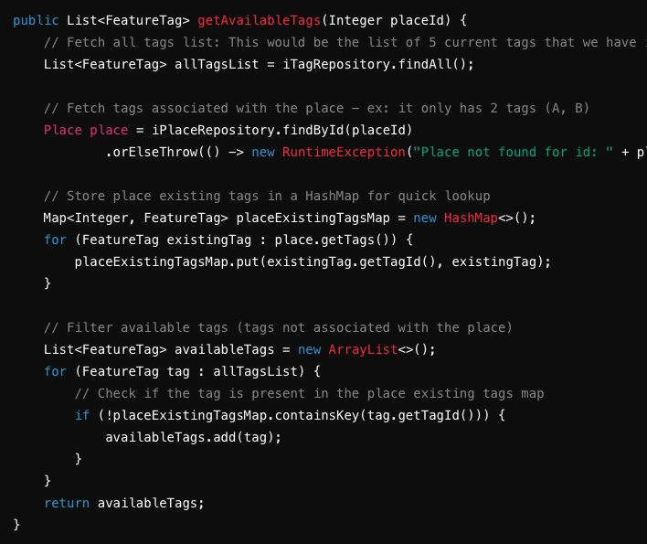

1. We create a hashmap named `placeExistingTagsMap` to store the tags associated with the place. The key is the `tagId` and the value is the `FeatureTag` instance. 
2. This map is populated by iterating through place.getTags() - and place is the one that aligns to the placeId of the place  the user is looking at in our Place Details page on the frontend.
3. When filtering available tags, we use placeExistingTagsMap.containsKey(tag.getTagId()) to check if the tag is associated with the place. If not, we add it to the availableTags list.


